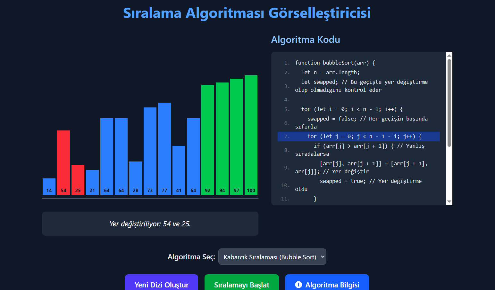

-----


## ✨ Features

  * **Multiple Algorithm Support:** Currently visualizes **Selection Sort** and **Bubble Sort** algorithms. (More can be added in the future\!)
  * **Step-by-Step Visualization:** Follow the algorithm's progress with colorful bars and smooth animations.
  * **Code Highlighting:** See the corresponding lines of code highlighted in real-time with each visual step, helping you connect the visuals to the logic.
  * **Detailed Info Panel:** Access comprehensive information about each algorithm, including its time/space complexity, working principles, advantages, and disadvantages.
  * **Interactive Controls:** Adjust animation speed, step forward/backward through the algorithm, or let it play automatically.
  * **Random Array Generation:** Generate new random arrays with a single click to experiment with different scenarios.
  * **Modern Tech Stack:** Built with **React**, **TypeScript**, **Vite**, **Tailwind CSS**, and **Framer Motion**.

-----

## 🚀 Quick Start

To get this project up and running on your local machine, follow these steps:

1.  **Clone the Repository:**

    ```bash
    git clone https://github.com/atillaertas1/sorting-algorithm-visualizer.git
    cd sorting-algorithm-visualizer
    ```

2.  **Install Dependencies:**

    ```bash
    npm install
    # or
    yarn install
    ```

3.  **Start the Development Server:**

    ```bash
    npm run dev
    # or
    yarn dev
    ```

    The application should open in your browser, typically at `http://localhost:5173`.

-----

## 🛠️ Technologies Used

  * **React**: A JavaScript library for building user interfaces.
  * **TypeScript**: A typed superset of JavaScript that compiles to plain JavaScript, enhancing code quality and scalability.
  * **Vite**: A fast and modern build tool that provides an extremely quick development server.
  * **Tailwind CSS**: A utility-first CSS framework that enables rapid UI development with pre-defined classes.
  * **Framer Motion**: A powerful and easy-to-use animation library for React.
  * **React Icons**: Provides a wide collection of popular icons as React components.
  * **Classnames**: A tiny utility for conditionally joining CSS class names.

-----

## 💡 How to Contribute

This project is open-source, and we welcome your contributions\! If you find a bug or have an idea for a new feature, here's how you can help:

1.  Fork the repository.
2.  Create a new branch (`git checkout -b feature/new-algorithm`).
3.  Make your changes and commit them (`git commit -m 'feat: Add new algorithm'`).
4.  Push your branch (`git push origin feature/new-algorithm`).
5.  Open a Pull Request.

Please consider reviewing the `CODE_OF_CONDUCT.md` file (if you add one).

-----

## 📜 License

This project is licensed under the MIT License. See the `LICENSE` file for more details.

-----

## 📞 Contact

  * **Your Name/Username** - [Atilla](https://github.com/atillaertas1)
  * **Project Link:** [https://github.com/atillaertas1/sorting-algorithm-visualizer]

-----